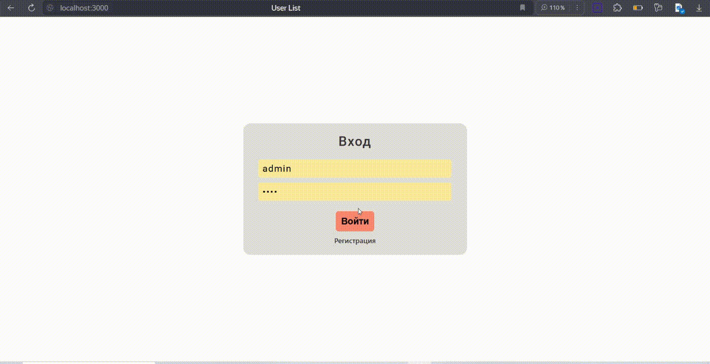

# Приложение для управления заметками с использованием шифрования и аутентификации

## 📌 **Общее описание**
Приложение предоставляет возможность управлять пользовательскими заметками и безопасно передавать данные между клиентом и сервером.

Демонстрация работы:

## 🔐 **Безопасность**
Приложение использует современные методы шифрования и аутентификации:  
- **Диффи-Хеллман (Diffie-Hellman)** — для безопасного обмена ключами между клиентом и сервером.  
- **AES (Advanced Encryption Standard)** — для симметричного шифрования данных.  
- **JWT (JSON Web Tokens)** — для аутентификации и авторизации пользователей.  
- **HKDF (HMAC-based Extract-and-Expand Key Derivation Function)** — для генерации симметричных ключей.  
- **Base64** — для кодирования зашифрованных данных перед отправкой.  

## **Функциональность**
Приложение предоставляет следующие функции:  
- **Регистрация и вход** — создание аккаунта и вход с использованием JWT.  
- **Добавление заметок** — возможность создавать новые заметки.  
- **Просмотр заметок** — клиенты видят свои заметки, администраторы — все.  
- **Редактирование заметок** — пользователи могут редактировать свои заметки.  
- **Удаление заметок** — возможность удалять свои заметки.  

## **Шифрование данных**
- Данные передаются в зашифрованном виде с использованием AES.  
- Генерация **IV (Initialization Vector)** происходит для каждого сообщения.  
- После шифрования данные кодируются в **Base64** для безопасной передачи.  

## **API Методы**

| HTTP Метод   | Эндпоинт                  | Описание                                                          | Авторизация |
|----------------|----------------------------|--------------------------------------------------------------------|-------------|
| `GET`         | `/get_keys`                | Получение открытых ключей для Диффи-Хеллмана                     | Не требуется |
| `POST`        | `/get_key_B`               | Передача открытого ключа `B` от клиента и вычисление общего ключа | Не требуется |
| `POST`        | `/compare_devire_key`      | Проверка корректности общего ключа                               | Не требуется |
| `POST`        | `/register_user`           | Регистрация нового пользователя                                  | Не требуется |
| `POST`        | `/enter_user`              | Вход пользователя и получение JWT                                | Не требуется |
| `POST`        | `/add_note`                | Добавление новой заметки                                         | Требуется JWT |
| `POST`        | `/get_user_notes`          | Получение списка заметок                                         | Требуется JWT |
| `POST`        | `/update_note`             | Редактирование заметки                                           | Требуется JWT |
| `POST`        | `/delete_note`             | Удаление заметки                                                 | Требуется JWT |

## **Пользователи и роли**
Приложение поддерживает два типа пользователей:  
- **Client** — может создавать, редактировать, просматривать и удалять только свои заметки.  
- **Admin** — имеет доступ ко всем заметкам.  

## **Примечания**
- При регистрации и входе пароли пользователей хэшируются с использованием `PasswordHasher`.
- JWT токены имеют срок действия 5 минут.
- Все заметки и данные, отправляемые на сервер, шифруются с использованием общего симметричного ключа.  
- Администраторы имеют доступ к данным всех пользователей, в то время как клиенты могут видеть только свои заметки.  

## **Пример работы**
1. Клиент запрашивает открытые ключи `p`, `g`, `A` с `/get_keys`.
2. Клиент генерирует свой ключ `B`, вычисляет общий секрет и отправляет его на `/get_key_B`.
3. После успешного установления общего ключа клиент шифрует данные и отправляет их на сервер.
4. Сервер расшифровывает данные, выполняет запрос (например, добавление заметки) и отправляет ответ в зашифрованном виде.

